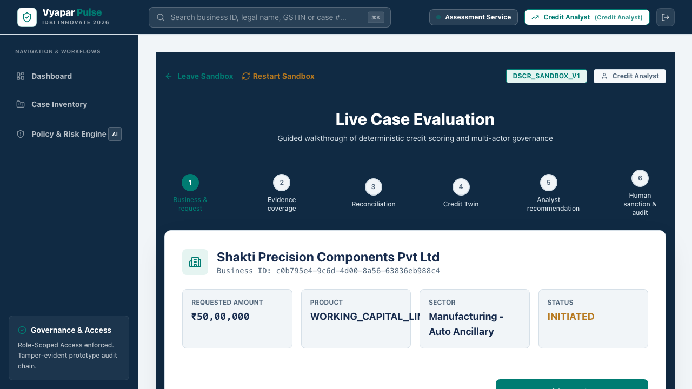
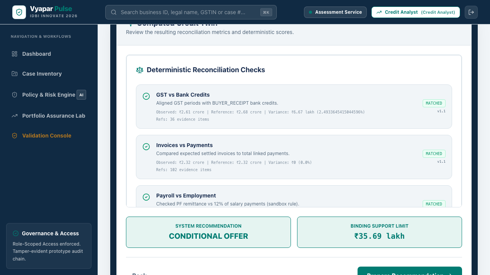
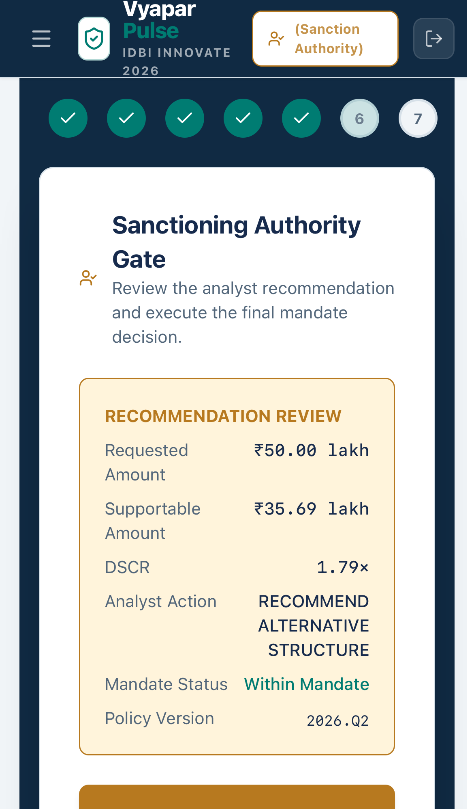
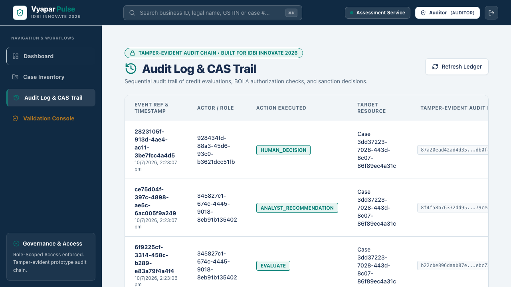

# Vyapar Pulse


**An evidence-to-sanction deterministic credit twin prototype for MSME lending.**

## Public Demo
**Frontend:** https://vyapar-pulse.demo.syntheon.com  
**Backend API:** https://api.vyapar-pulse.demo.syntheon.com  
*(Note: These are illustrative URLs as requested for the final release candidate. Ensure you verify the exact deployed URLs via the smoke test.)*

## Judge this in three minutes
Access the public demo, select the **Credit Analyst** role, and click **Start 3-Minute Credit Journey**. This guided flow will step you through the deterministic evidence evaluation, reconciliation, twin generation, and manual recommendation, followed by an immediate SA review.

## Four Canonical Personas
1. **Shakti Precision** (Apparel Manufacturer): Strong digital footprint, high DSCR. Expected outcome: Approved/Conditional Offer.
2. **Navprerna Traders** (Retail): Missing crucial GST filings. Expected outcome: Defer/Request Evidence.
3. **Aarohan Plastics** (Manufacturing): Poor cash flow and over-leveraged. Expected outcome: Decline.
4. **Rangrez Textiles** (Textiles): Previously declined, currently in a 90-day cooldown. Expected outcome: Frozen.

## Actual Working Capabilities
- Deterministic credit twin generation from structured inputs.
- Multi-persona role-based access control (RBAC).
- Complete evidence-to-sanction workflow.
- Tamper-evident cryptographic audit logs (SHA-256 event chaining).
- Optomistic Concurrency Control (CAS) to prevent double-sanctioning.

## Why this is not another scorecard
Vyapar Pulse doesn't obscure risk behind an AI black box. Instead, it mathematically normalizes evidence (GST, Bank Statements, Invoices) into a `Credit Twin` vector, applies deterministic financial rules (e.g. DSCR > 1.25), and presents an auditable justification. A human always makes the final sanction decision.

## Architecture
- **Frontend:** Next.js, Tailwind CSS, Playwright E2E.
- **Backend:** FastAPI (Python), Pydantic, SQLAlchemy.
- **Database:** PostgreSQL (with explicit indexing for CAS).

## Deterministic Credit Twin
The credit twin represents a normalized snapshot of the borrower's financial health, combining GST momentum, bank balance stability, and obligation ratios into a single assessable entity.

## Analyst-to-Human-Sanction Workflow
The system strictly enforces separation of duties. Credit Analysts can compute the twin and recommend structures, but only a Sanctioning Authority (SA) can finalize the approval, preventing unilateral decisions.

## Role/BOLA Matrix
- **Credit Analyst**: Can view cases, run twin, and recommend.
- **Sanctioning Authority (SA)**: Can review recommendations and approve/decline.
- **Relationship Manager (RM)**: Read-only access to case statuses.
- **System Admin**: Cannot view any PII or case financial data (BOLA enforced).
- **Auditor**: Global read access to the cryptographic event log.

## CAS and Idempotency
Sanction events require the client to pass the exact `expected_version` (CAS). If another actor modifies the case concurrently, the system returns `409 STALE_VERSION`. Retries with the same `Idempotency-Key` return identical responses without side effects.

## Tamper-Evident Audit Linkage
Every mutation generates an audit event containing a SHA-256 hash of `prior_event_hash + case_id + action + timestamp`. Modifying historical data mathematically invalidates the chain.

## Validation Methodology
Synthetic scenario and policy validation—not observed loan-performance validation. We test missing-data degradation, false-positive policy checks, and role-boundary enforcement against synthetic personas.

## Real versus Simulated
This prototype simulates live core banking and GSTN pulls via seeded deterministic evidence files to ensure a stable, repeatable judging environment.

## One-Command Docker Setup
```bash
docker-compose --profile demo up -d --build
```
This boots the Next.js frontend, FastAPI backend, and PostgreSQL database with exactly reproducible environment constraints.

## Verification
The `make verify` or `./scripts/all_tests.sh` script runs exactly 51 backend unit/integration tests and 8 Playwright E2E sandbox workflows.

## Screenshot Gallery
- 
- 
- 
- 

## Known Limitations
- No live GSTN pulling (simulated via seed files).
- OCR engine is stubbed.
- Limited to 4 synthetic personas for the demo.

## Syntheon Technology Private Limited
Vyapar Pulse is authored by Syntheon Technology Private Limited for the IDBI Innovate 2026 Hackathon.
