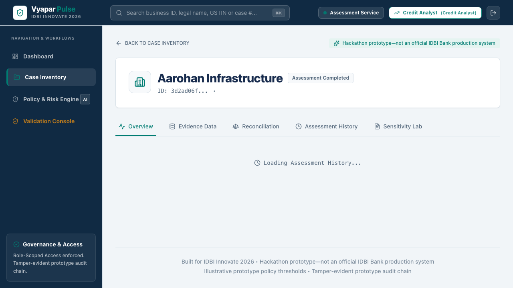

# Vyapar Pulse


**An evidence-to-sanction deterministic credit twin prototype for MSME lending.**

## Value Proposition
Vyapar Pulse doesn't obscure risk behind an AI black box. Instead, it mathematically normalizes evidence (GST, Bank Statements, Invoices) into a `Credit Twin` vector, applies deterministic financial rules (e.g. DSCR > 1.15), and presents an auditable justification. A human always makes the final sanction decision.

## Public Demo
*Deployment pending external DNS and HTTPS resolution.*

## Judge this in three minutes
Access the demo, select the **Credit Analyst** role, and click **Start 3-Minute Credit Journey**. This guided flow will step you through the deterministic evidence evaluation, reconciliation, twin generation, and manual recommendation, followed by an immediate SA review.

## Four Canonical Personas
1. **Shakti Precision** (Manufacturing — Auto Ancillary, Working Capital Line): ₹50 lakh requested, DSCR 1.85, ₹35.69 lakh supportable. Expected outcome: CONDITIONAL_OFFER.
2. **NavPrerna Traders** (Retail): Missing crucial GST filings. Expected outcome: ADDITIONAL_EVIDENCE_REQUIRED.
3. **Nirmaan Infrastructure Services** (Construction): Poor cash flow and over-leveraged. Expected outcome: DECLINE_RECOMMENDED.
4. **Rangrez Textiles** (Textiles): Currently in a cooldown state. Expected outcome: READY_FOR_REVIEW, but ultimately declined.

## Decision Package
Vyapar Pulse provides a comprehensive, deterministic Decision Package output for every case, embedding the complete audit and calculation versions.

## Decision Sensitivity Lab
An illustrative sensitivity analysis tool—not a sanction decision—allowing you to stress-test revenue, obligations, and evidence source variations.

## Validation Console
A synthetic scenario and policy validation interface—not observed loan-performance validation—to assert role boundaries, missing-data degradation, and idempotency replay.

## Architecture
- **Frontend:** Next.js, Tailwind CSS, Playwright E2E.
- **Backend:** FastAPI (Python), Pydantic, SQLAlchemy.
- **Database:** PostgreSQL (with explicit indexing for CAS).

## Analyst-to-Human-Sanction Workflow
The system strictly enforces separation of duties. Credit Analysts can compute the twin and recommend structures, but only a Sanctioning Authority (SA) can finalize the approval, preventing unilateral decisions.

## Role/BOLA Matrix
- **Credit Analyst**: Can view cases, run twin, and recommend.
- **Sanctioning Authority (SA)**: Can review recommendations and approve/decline.
- **Relationship Manager (RM)**: Read-only access to case statuses.
- **System Admin**: Cannot view any borrower content in the DOM. GET /cases returns exact expected denial.
- **Auditor**: BOLA-scoped read-only audit access.

## CAS and Idempotency
Sanction events require the client to pass the exact `expected_version` (CAS). If another actor modifies the case concurrently, the system returns `409 STALE_VERSION`. Retries with the same `Idempotency-Key` return identical responses without side effects.

## Tamper-Evident Audit Linkage
Every mutation generates an audit event containing a SHA-256 hash of `prior_event_hash + case_id + action + timestamp`. Modifying historical data mathematically invalidates the chain.

## Validation Methodology
Synthetic scenario and policy validation—not observed loan-performance validation. We test missing-data degradation, false-positive policy checks, and role-boundary enforcement against synthetic personas.

## Real versus Simulated
This prototype simulates live core banking and GSTN pulls via seeded deterministic evidence files to ensure a stable, repeatable judging environment.

## One-Command Docker Setup
```bash
docker-compose --profile demo up -d --build
```
This boots the Next.js frontend, FastAPI backend, and PostgreSQL database with exactly reproducible environment constraints.

## Screenshot Gallery
- 
- 
- 
- 
- 
- 
- 
- 
- 

## Known Limitations
- No live GSTN pulling (simulated via seed files).
- OCR engine is stubbed.
- Limited to 4 synthetic personas for the demo.

## Syntheon Technology Private Limited
Vyapar Pulse is authored by Syntheon Technology Private Limited for the IDBI Innovate 2026 Hackathon.
