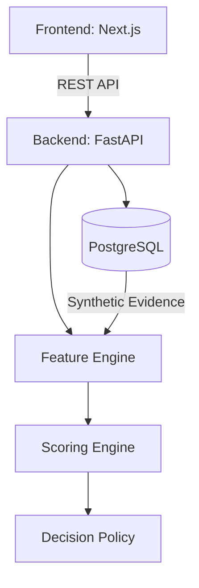

# VYAPAR PULSE AI


An Evidence-First Financial Health Card, MSME Credit Twin, and Safe-Offer Engine for credit-invisible Indian MSMEs. Built for the **IDBI Innovate 2026 Track 03** submission by **Syntheon Technology Private Limited**.

## Mission
Vyapar Pulse AI helps banking institutions assess New-to-Bank (NTB) MSMEs lacking traditional financial documents. It achieves this by combining synthetic GST data, consented Account Aggregator-style banking data, UPI aggregates, EPFO employment trends, and invoice metrics into a deterministic, fully explainable "Credit Twin". 

This is **not** a generic dashboard and **not** an LLM wrapper. LLMs are strictly bounded to generating narrative summaries; the authoritative scoring logic is 100% deterministic, monotonic, and bounded code.

## Key Capabilities & Safety Invariants
- **Deterministic Bounded Scoring:** Scores (Health, Evidence, Resilience) are mathematically guaranteed to remain between `[0, 100]`.
- **Monotonic Stress Response:** As risk factors (e.g., buyer concentration, payment delays) increase, resilience scores strictly decrease or remain stable.
- **Evidence-Linking:** Every feature is derived directly from auditable underlying data (GST, Bank, EPFO).
- **Strict Architecture Boundaries:** LLMs cannot modify authoritative scores. Data flows via a strict Clean Architecture pattern.

## Architecture



## Differentiators

Unlike standard dashboards or LLM-wrappers, Vyapar Pulse is an **Evidence-First** engine:
1. **Deterministic Bounded Scoring:** Financial Health, Evidence, and Resilience scores are mathematically bounded `[0, 100]`.
2. **Monotonic Stress Response:** As risk factors (e.g., buyer concentration, payment delays) increase, resilience scores strictly decrease or remain stable.
3. **No LLM Hallucinations in Core Logic:** Authoritative credit decisions, policy constraints, and offer generation are 100% deterministic code. LLMs are strictly bounded to generating explainable narrative summaries of the numeric data.
4. **Tamper-Evident Audit Trails:** Every system action and human decision is logged with cryptographic hashing.

## Demo Personas

The prototype includes four distinct MSME archetypes to demonstrate the decision engine's edge cases:

| Legal Name | Persona Profile | Key Constraint | System Recommendation |
| :--- | :--- | :--- | :--- |
| **Shakti Precision Components** | Ideal "Credit-Invisible" MSME. 18 months of GST & AA data. | None | **CONDITIONAL_OFFER** / **READY_FOR_REVIEW** |
| **Navprerna Tech Solutions** | Genuinely missing periods or source evidence. | Low Evidence Confidence | **ADDITIONAL_EVIDENCE_REQUIRED** |
| **Rangrez Textiles** | Viable but highly seasonal cash flows. | High Revenue CV | **READY_FOR_REVIEW** |
| **Aarohan Infrastructure** | High existing debt obligations. | Low DSCR (< 1.15) | **DECLINE_RECOMMENDED** |

## One-Command Demo

We provide a streamlined makefile for evaluators to run the entire stack and verify the decision logic.

### Prerequisites
- Docker & Docker Compose
- `make`

### Commands

1. **Start the environment (detached)**
```bash
make demo-up
```

2. **Reset the database and seed exactly 4 personas**
```bash
make demo-reset
```

3. **Verify the decision logic (Decision Assurance)**
```bash
make verify
```

4. **Tear down everything**
```bash
make demo-down
```

## Demo Credentials

> **Note:** As a bank-internal underwriting platform, there is no public self-registration. Users are strictly provisioned by an administrator. Use the credentials below to log in.

| Role | Email | Password | Allowed Actions |
| :--- | :--- | :--- | :--- |
| **Relationship Manager (RM)** | `rm@bank.example` | `demopassword` | View cases, View read-only assessment, Acknowledge decisions |
| **Credit Analyst (CA)** | `credit@bank.example` | `demopassword` | Run assessment, View full details, Submit recommendation |
| **Sanctioning Authority (SA)** | `sa@bank.example` | `demopassword` | Review CA recommendations, Approve/Decline |
| **Auditor** | `auditor@bank.example` | `demopassword` | View tamper-evident logs |
| **System/Admin** | `system@bank.example` / `admin@bank.example` | `demopassword` | Administration tasks |

## Known Limitations & Future Work
- **Sandbox Rules:** The credit policies and limits in `SafeLimitEngine` (e.g. 20% Nayak Committee heuristic) are illustrative prototype assumptions, not exact production policies.
- **Mock Aggregator:** The Account Aggregator implementation uses synthetic seeded data rather than a live Sahamati sandbox connection.

## Repository Quality Standards
This repository enforces:
- Clean Architecture (API, Core, Domain, DB layers isolated)
- SQLAlchemy ORM with Alembic schema migrations
- Deterministic data seeding for reproducibility
- Security by design (threat models, access controls, BOLA checks)
