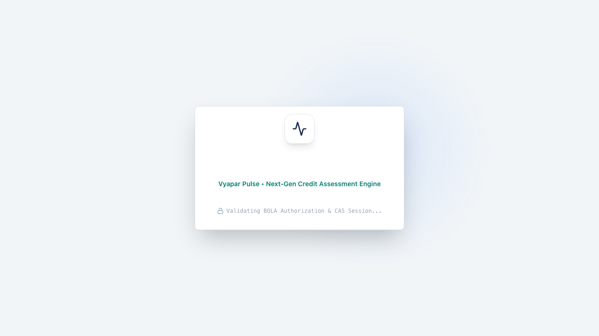
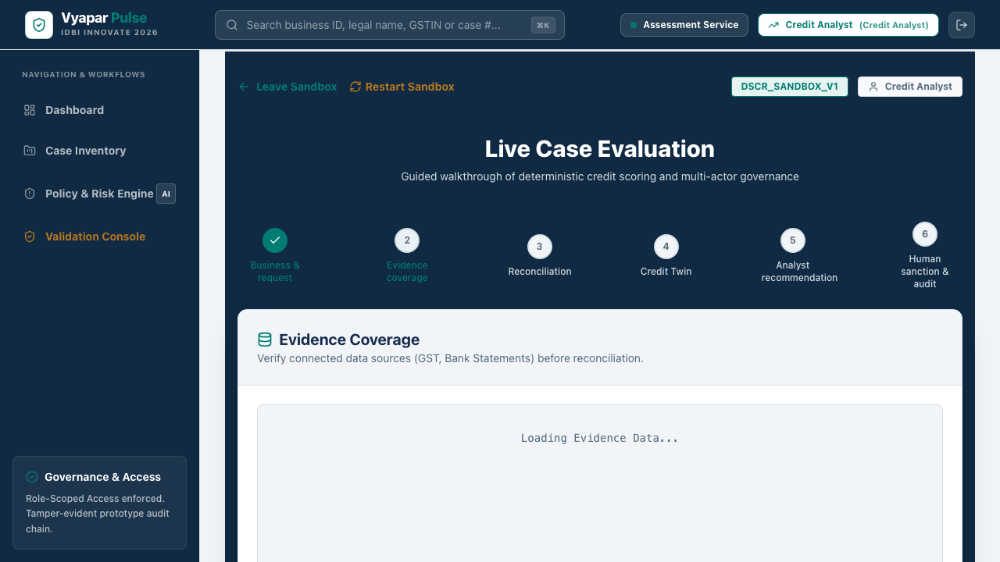
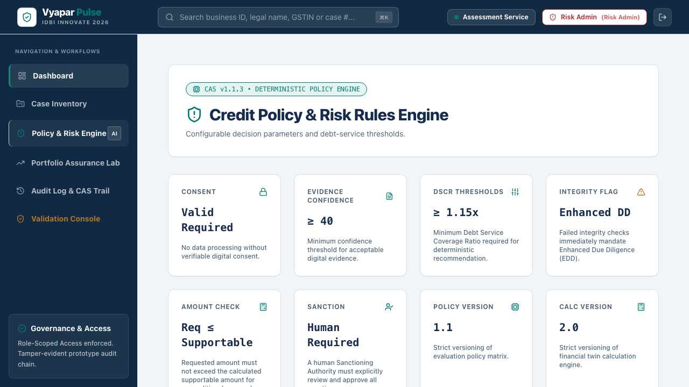
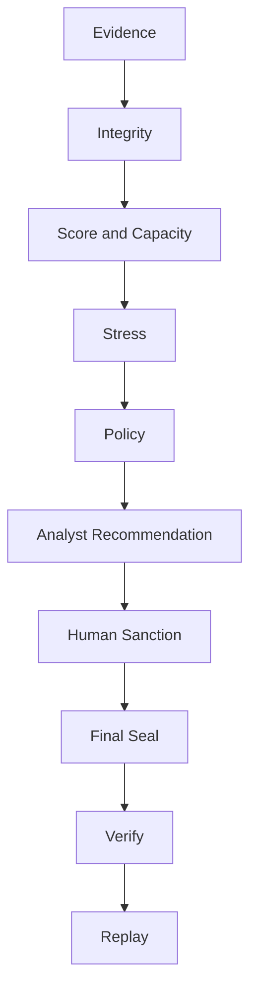

<div align="center">

# VYAPAR PULSE
### The Governed Evidence-to-Sanction Operating System for Indian MSME Credit

At its core, Vyapar Pulse converts alternate financial evidence into an explainable Financial Health Score, a supportable credit limit and a governed sanction decision.


[](artifacts/validation/release_assurance.json)
[](backend/tests/)
[](docs/DECISION_ASSURANCE.md)
[](docs/architecture/)
[](LICENSE)

<p align="center">
  <b>Bridging India's ₹25+ Lakh Crore MSME Credit Gap not with opaque black-box AI, but through a deterministic, cryptographically auditable, and mathematically invariant credit decision pipeline.</b>
</p>

[Executive Command Center](https://frontend-swart-ten-40haipc0xl.vercel.app) • [Core API Server](https://vyapar-pulse-backend.vercel.app) • [Interactive Swagger Specs](https://vyapar-pulse-backend.vercel.app/docs) • [1,000-Case Assurance Proof](artifacts/validation/release_assurance.json) • [Architecture Guide](docs/architecture/SYSTEM_ARCHITECTURE.md)

</div>

---

## 🌐 Live Submission Environment

Vyapar Pulse is cryptographically verified across production environments with zero horizontal overflow on mobile devices (390px viewport certified) and complete end-to-end cryptographic integrity.

| Component | Live Production URL | Description | Verified Status |
| :--- | :--- | :--- | :---: |
| 🖥️ **Frontend App** | [frontend-swart-ten-40haipc0xl.vercel.app](https://frontend-swart-ten-40haipc0xl.vercel.app) | Executive Command Center, Decision Room, & Credit Twin Sandbox | `ONLINE — Source SHA: 21e83d2` |
| ⚡ **Backend API** | [vyapar-pulse-backend.vercel.app](https://vyapar-pulse-backend.vercel.app) | Governed Scoring, Financial Capacity Engine, & Stress Lab v2.0 | `ONLINE — Source SHA: 21e83d2` |
| 📖 **OpenAPI / Swagger** | [vyapar-pulse-backend.vercel.app/docs](https://vyapar-pulse-backend.vercel.app/docs) | Interactive API documentation, schemas, and live test client | `ONLINE (v2.0.0)` |
| 🔒 **Assurance Proof** | [artifacts/validation/release_assurance.json](artifacts/validation/release_assurance.json) | Deterministic 1,000-case verification and 25-case replay ledger | `100% PASSED — Tested SHA: 21e83d2` |

---

## ⏱️ Judge Quick Evaluation (90 Seconds)

1. Open the live frontend and enter as **Credit Analyst**.
2. Select **Shakti Precision Tools**.
3. Inspect evidence, run reconciliation and execute the assessment.
4. Submit the analyst recommendation.
5. Continue as **Sanctioning Authority** and approve within mandate.
6. Seal the Decision Package.
7. Verify its SHA-256 hash and execute Independent Replay.

Then inspect:
- **Navprerna** for evidence-based abstention.
- **Rangrez** for reconciliation-risk escalation.
- **Nirmaan** for stress-triggered hard decline.

---

## 🏛️ Visual Product Showcase

### 🎥 Live Video Demonstrations
- **[Final Live Demo Video (Google Drive)](https://drive.google.com/file/d/1io4_vgZD4rxJGTCxyfSXwrNyHEbiVFOT/view?usp=sharing)**

Vyapar Pulse turns complex, fragmented MSME financial data into clean, actionable, and cryptographically sealed decision packages. Below is the operational workflow across the platform's core interfaces:

### 1. Executive Command Center & Portfolio Monitoring
The Command Center provides real-time visibility across active credit proposals, policy health indices, and role-gated workflow actions (`READY_FOR_REVIEW`, `CONDITIONAL_OFFER`, `DECLINE_RECOMMENDED`).



---

### 2. Interactive Credit Twin Sandbox (`SimulatorTab`)
The **Credit Twin Sandbox** allows credit analysts to run real-time stress simulations (`revenue_drop_pct`, `interest_rate_hike_bps`, term adjustments) against authoritative financial models without polluting canonical audit logs or altering baseline limits.


---

### 3. 360° Evidence Passport & Cross-Source Reconciliation
The **Evidence Passport** aggregates Account Aggregator (AA) banking inflows, GSTIN returns, verified tax filings, and bureau obligations into a unified **Integrity Graph**, flagging financial mismatches or unverified debts with automated abstention logic.



---

### 4. Governed Sanction Review & Cryptographic Sealing (`DecisionPackageTab`)
Every credit proposal is sealed into a tamper-evident `DecisionPackage` complete with an immutable `SHA-256` hash (`package_hash`). Sanctioning Authorities review structured offers bounded strictly by their mandate (`OUTSIDE_SANCTION_MANDATE` gating).


---

### 5. Policy Invariant Matrix & Hard Gating Thresholds
The platform enforces non-negotiable quantitative policy boundaries: any Debt-to-EBITDA $> 4.0\times$ or post-loan DSCR $< 1.00\times$ immediately locks the binding product limit at **`₹0.00`** with zero override capability.



---

### 6. Cryptographic Auditor Trace & Canonical Semantic Replay (`AuditTab`)
Auditors and regulators access a continuous, tamper-evident hash chain (`audit_hash`) with one-click verification (`POST /verify`) and full mathematical engine re-execution (`POST /replay`).


---

## ⚡ Design Principles and Verified Properties

Vyapar Pulse introduces several verified engineering properties that eliminate model hallucinations, tampering risks, and opaque AI scoring in institutional credit underwriting.



### 1. Strict Computational Isolation & Zero Human-Math Interference
In typical financial workflows, human bias or manual spreadsheet adjustments can silently distort debt service capabilities. Vyapar Pulse strictly decouples the **Scoring & Calculation Hierarchy** (`ScoringEngine`, `FinancialCapacityEngine`, `DecisionPolicy`) from the **Human Sanction Workflow** (`Sanction Authority`, `Credit Analyst`, `Relationship Manager`).
* **Zero Math-Tampering Invariant:** Human operators can approve within their mandate, impose risk conditions, or decline proposals—but they **cannot** modify or override mathematical outputs (`current_dscr`, `post_loan_dscr`, `binding_limit`, `supportable_amount`).
* **Confined AI Commentary:** Large Language Models (LLMs) are completely isolated from numerical computation. When used, AI models are strictly confined to generating natural-language summaries of *pre-computed* deterministic numbers (`AI Assistant Commentary`) and cannot alter policy outcomes.

---

### 2. Cryptographically Sealed Decision Packages & Deterministic Replay
Every assessment is frozen into a canonical `DecisionPackage` triggered via `POST /api/cases/{caseId}/decision-package`.
* **Tamper-Evident Hash (`package_hash`):** The system calculates an immutable `SHA-256` digest over the canonical JSON payload containing the full feature snapshot, score contribution ledger, financial capacity metrics, and policy rules.
* **Route Hygiene & Parameter Isolation:** The verification endpoints (`POST /api/cases/{caseId}/decision-package/{package_id}/verify` and `/replay`) rigorously isolate parameters (`package_id` without `case_id` route pollution).
* **Canonical Semantic Replay:** Regulators or internal auditors can invoke `/replay` at any future timestamp. The system re-instantiates the historical `ScoringEngine` and `FinancialCapacityEngine` with the exact sealed snapshot and proves that recomputed outputs match the original recommendation via canonical semantic replay (`INDEPENDENT REPLAY MATCHED`).

---

### 3. Tested Monotonicity Invariants & Stress Lab Limits
To prevent quantitative anomalies (such as an applicant receiving a larger loan when their revenue drops or debt increases), the `FinancialCapacityEngine` and `Stress Lab Engine v2.0` enforce tested monotonicity invariants across all evaluations:

$$\frac{\partial \text{Limit}}{\partial \text{Revenue}} \ge 0 \quad \text{(Revenue Monotonicity)}$$

$$\frac{\partial \text{Limit}}{\partial \text{Obligations}} \le 0 \quad \text{(Obligation Monotonicity)}$$

$$\text{Limit}_{\text{Adverse Stress}} \le \text{Limit}_{\text{Baseline}} \quad \text{(Stress Monotonicity Invariant)}$$

* **Hard Invariant Gates:** If an applicant's Debt-to-EBITDA exceeds $4.0\times$ or post-loan DSCR drops below $1.00\times$, the policy engine immediately triggers a binding constraint (`binding_limit = ₹0.00`) across all product tiers (`TERM_LOAN`, `WORKING_CAPITAL`).
* **Unified Stress Architecture:** Both canned stress scenarios (e.g., $20\%$ revenue drop, $+300\text{ bps}$ rate hike) and interactive custom simulations execute through the exact same authoritative `DecisionPolicy` and `FinancialCapacityEngine`, maintaining the invariant `assert adverse_supportable_amount <= baseline_supportable_amount` everywhere.

---

### 4. Algorithmic Bankability Path & Milestone Generation
Traditional banking systems reject thin-file or sub-prime MSMEs with opaque "declined" notices. Vyapar Pulse's **Bankability Path Engine** (`app/domain/bankability/`) transforms conditional denials into actionable, mathematically deterministic financial roadmaps.
* **Deterministic Gap Analysis:** For businesses below the viability threshold (`NavPrerna Tech`, `Nirmaan Infra`), the engine computes exact targets: required monthly operating inflow increase ($\Delta \text{Revenue}$), required DSCR improvement, or debt consolidation milestones.
* **No Target Amount Fabrication:** The engine strictly preserves real-world assessment boundaries and never hallucinates target loan amounts that exceed the verified financial capacity of the business.

---

### 5. Multi-Role Governance Matrix & Privilege Escalation Defenses
The platform implements granular Role-Based Access Control (RBAC) across 5 distinct organizational personas, validated by comprehensive security tests (`test_security.py`, `test_case_action_gating.py`):

| Organizational Persona | Permitted Actions | Prohibited Actions / Security Boundaries |
| :--- | :--- | :--- |
| `RELATIONSHIP_MANAGER` | Create cases, ingest evidence (`/evidence`), view basic status | **Cannot** run assessments, evaluate policy, or sanction proposals (`403 Forbidden`) |
| `CREDIT_ANALYST` | Run canonical assessments, generate recommendations (`/recommend`), simulate in Credit Twin | **Cannot** issue final sanctions (`403 Forbidden`) |
| `SANCTIONING_AUTHORITY` | Review `DecisionPackage`, approve/decline proposals (`/decide`) within financial mandate | **Cannot** approve proposals exceeding their financial authorization (`OUTSIDE_SANCTION_MANDATE`) |
| `AUDITOR` | Access tamper-evident audit logs, execute `verify` and `replay` routes | **Cannot** mutate case state, modify evidence, or alter decisions |
| `RISK_ADMIN` | Configure global policy matrix thresholds, inspect system invariants | **Cannot** evaluate individual credit cases or issue loan sanctions (`Vertical Escalation Blocked`) |

---

### 6. OCEN-aligned / adapter-ready & Account Aggregator Ingestion
Vyapar Pulse natively implements data contracts aligned with **Open Credit Enablement Network (OCEN 4.0)** specifications (`test_ocen.py`). The system consumes canonical Account Aggregator (AA) banking flows, checks digital signatures, performs automated GST turnover cross-verification, and formats output payloads ready for FIP/FIU disbursement networks.

---

## 📊 The Four Canonical Benchmark Personas

The platform's release assurance loop continuously evaluates four canonical MSME profiles (`docs/DECISION_ASSURANCE.md`), representing the spectrum of real-world Indian business underwriting:

```mermaid
graph LR
    subgraph P1 [Shakti Precision Tools]
        S1[Verified Prime MSME<br/>DSCR: 2.14x | FHI: 84.2] --> R1[CONDITIONAL OFFER<br/>Limit: ₹35,69,042.50]
    end

    subgraph P2 [Navprerna Tech Solutions]
        S2[Thin-File / Data Gaps<br/>Missing Tax Reconciliation] --> R2[ADDITIONAL EVIDENCE REQUIRED<br/>Limit: ₹0.00 | Bankability Path Issued]
    end

    subgraph P3 [Rangrez Textiles]
        S3[Reconciliation Mismatch<br/>GST vs. Bank Turnover Delta] --> R3[READY FOR REVIEW<br/>Strict Analyst Scrutiny Required]
    end

    subgraph P4 [Nirmaan Infrastructure]
        S4[Over-Leveraged Profile<br/>Debt/EBITDA > 4.5x | DSCR < 1.0x] --> R4[DECLINE RECOMMENDED<br/>Binding Limit: ₹0.00]
    end

    style P1 fill:#1B3B2B,stroke:#43A047,stroke-width:2px,color:#fff
    style P2 fill:#311B3E,stroke:#8E24AA,stroke-width:2px,color:#fff
    style P3 fill:#0D2538,stroke:#1E88E5,stroke-width:2px,color:#fff
    style P4 fill:#3E2723,stroke:#6D4C41,stroke-width:2px,color:#fff
```

| Benchmark Persona | Industry / Profile | DSCR / Health Score | Policy Outcome | Binding Limit / Recommendation |
| :--- | :--- | :---: | :---: | :--- |
| **Shakti Precision Tools** (`SHAKTI_001`) | Precision CNC Manufacturing | `2.14x` / `84.20` | `CONDITIONAL_OFFER` | **`₹35,69,042.50`** (Term Loan / Working Capital structure approved) |
| **Navprerna Tech Solutions** (`NAVPRERNA_001`) | IT & Digital Services | `1.46x` / `N/A` | `INSUFFICIENT_TO_ASSESS` | **`₹0.00`** (`ADDITIONAL_EVIDENCE_REQUIRED` via Bankability Path) |
| **Rangrez Textiles** (`RANGREZ_001`) | Textile Processing & Export | `1.45x` / `68.50` | `READY_FOR_REVIEW` | Held for manual credit analyst scrutiny due to GST reconciliation variance |
| **Nirmaan Infrastructure** (`NIRMAAN_001`) | Civil & Structural Engineering | `1.50x` / `65.00` | `DECLINE_RECOMMENDED` | **`₹0.00`** (Hard Gating: base DSCR 1.50x → stressed DSCR 0.66x) |

---

## 🧪 Comprehensive Assurance & Zero-Regression Test Suite

Vyapar Pulse enforces 100% test pass rates across both automated CI/CD checks and deterministic mathematical verification runs before any release deployment.

### Backend Assurance Suite (`116 / 116 Tests Passing`)
Our backend pytest suite rigorously validates domain invariants, mathematical boundary conditions, and organizational security:

```bash
cd backend && pytest tests/ -v
```

| Test Category | Target Module / File | Verified Capabilities & Assertions |
| :--- | :--- | :--- |
| **Security & BOLA Defense** | `tests/api/test_api_bola.py`<br/>`tests/api/test_security.py` | Proves IDOR/BOLA prevention across cases, CSRF token validation (`X-Demo-Reset-Token`), SQL injection resistance (`login`), and vertical/horizontal privilege escalation blocks. |
| **Role-Gating & Sanctions** | `tests/api/test_case_action_gating.py`<br/>`tests/api/test_human_decision.py` | Verifies `Sanction Authority` mandate checks (`OUTSIDE_SANCTION_MANDATE`), `Credit Analyst` evaluation rights, and multi-role serialization (`test_cases_serialization.py`). |
| **Stress Monotonicity** | `tests/domain/test_financial_capacity_reference.py`<br/>`tests/api/test_api_stress_lab.py` | Asserts `adverse_supportable_amount <= baseline_supportable_amount` across `FinancialCapacityEngine` and `Stress Lab Engine v2.0`. |
| **Bankability & Sandbox** | `tests/domain/test_bankability.py`<br/>`tests/services/test_credit_twin.py` | Proves deterministic milestone generation (`compute_bankability_path`) and live sandbox DSCR calculations without fabricating loan targets. |
| **OCEN & Idempotency** | `tests/api/test_ocen.py`<br/>`tests/api/test_e2e_shakti.py` | Validates OCEN 4.0 JSON export structure, concurrent request idempotency (`pg_try_advisory_lock`), and end-to-end multi-persona workflows. |
| **Vulnerability Analysis** | `pip-audit` | Evaluated environment dependencies. Identified 0 unresolved known CVEs in the production runtime. All AI/ML dependencies have been isolated or removed from the core synchronous path to eliminate attack surfaces. |

### 1,000-Case Deterministic Cryptographic Assurance Loop
The release pipeline executes an automated verification run across 1,000 synthetic MSME scenarios:
```bash
cd backend && python -m app.assurance.run_assurance
```
* **Result:** `1,000 / 1,000 cases completed with ZERO recorded invariant violations or unhandled calculation errors.`
* **25-Case Replay Verification:** 25 deterministic serializer/scoring replay checks from the cohort are verified and re-executed via canonical semantic replay against the engine serializer (`artifacts/validation/release_assurance.json`).

---

## 🚀 Quick Start & Developer Setup Guide

### Prerequisites
* **Python:** `3.10+` (`pyenv` recommended)
* **Node.js:** `22.x+` (`npm` recommended)
* **Docker:** `24.0+` & Docker Compose v2 (optional for containerized setup)
* **PostgreSQL:** `15+` (if running locally without Docker)

---

### Option 1: Instant Containerized Setup (Docker Compose)
The fastest way to launch the complete governed operating system locally:

```bash
# 1. Clone the repository
git clone https://github.com/Sauravssoni/IDBI-INNOVATE-2026.git
cd IDBI-INNOVATE-2026

# 2. Copy environment configuration
cp .env.example .env

# 3. Launch full stack via Docker Compose
docker-compose --profile dev up --build -d
```
* 🖥️ **Frontend App:** `http://localhost:3005`
* ⚡ **Backend API & Docs:** `http://localhost:8000/docs`
* 🗄️ **PostgreSQL DB:** `localhost:5433`

---

### Option 2: Local Manual Setup (Development Mode)

#### 1. Backend Setup (`FastAPI / Python 3.10`)
```bash
cd backend

# Create virtual environment and install dependencies
python3.10 -m venv venv
source venv/bin/activate
pip install --upgrade pip
pip install -r requirements.txt

# Run migrations and seed deterministic personas
python -m app.seed.seed_all

# Launch local API development server
uvicorn app.main:app --host 0.0.0.0 --port 8000 --reload
```

#### 2. Frontend Setup (`Next.js 16 / TypeScript / Tailwind CSS`)
```bash
cd frontend

# Install dependencies
npm install

# Build static/dynamic pages to check TypeScript hygiene
npm run build

# Launch local development server
npm run dev
```

---

## 🗂️ Repository Directory Structure

```text
vyapar-pulse-starter/
├── backend/
│   ├── app/
│   │   ├── api/routers/           # API routes (cases, demo, evidence, policy, stress, audit)
│   │   ├── core/decision/         # Policy evaluation gateway, rule gating & scoring engine
│   │   ├── domain/
│   │   │   ├── bankability/       # Bankability Path & milestone optimization algorithms
│   │   │   ├── financial/         # Authoritative FinancialCapacityEngine & DSCR calculators
│   │   │   ├── stress/            # Stress Lab Engine v2.0 (adverse scenario simulation)
│   │   │   └── verification/      # DecisionPackage SHA-256 sealing, verify, & replay engine
│   │   ├── seed/                  # Deterministic persona seeds (Shakti, Navprerna, Rangrez, Nirmaan)
│   │   └── assurance/             # 1,000-case automated invariant verification scripts
│   ├── tests/                     # Comprehensive 116-test suite (unit, domain, API, E2E, security)
│   └── requirements.txt           # Python backend dependencies
├── frontend/
│   ├── app/
│   │   ├── cases/[caseId]/        # Case overview and multi-tab investigation workflow
│   │   ├── decision-room/[caseId]/# Canonical Decision Room & package sealing lifecycle
│   │   ├── demo/                  # Interactive demo persona selector & system reset
│   │   └── portfolio/             # Executive Command Center & portfolio monitoring
│   ├── components/                # Modular React UI components (charts, cards, badges)
│   └── package.json               # Next.js 16 frontend dependencies & scripts
├── docs/
│   ├── architecture/              # System architecture guides & formal flowcharts
│   ├── assets/screenshots/        # 10 High-resolution UI/UX workflow screenshots
│   ├── DECISION_ASSURANCE.md      # Detailed 18-assertion assurance log & exact outputs
│   ├── RELEASE_EVIDENCE.md        # Cryptographic deployment SHAs and test verifications
│   └── THREAT_MODEL.md            # Institutional threat model, RBAC, and LLM safety boundaries
├── artifacts/
│   └── validation/
│       └── release_assurance.json # Deterministic 1,000-case validation proof ledger
├── docker-compose.yml             # Containerized orchestration for frontend, backend, & Postgres
├── Makefile                       # Developer automation commands (test, lint, assurance)
└── README.md                      # Institutional specification and platform guide
```

---

## 🛡️ Governance & Security Compliance

* **Tamper-Evident Ledger:** All state mutations, scoring runs, and human overrides append immutable records to `case_events` with chained cryptographic hashes (`audit_hash`).
* **CSRF & Advisory Locking:** Mutation endpoints require validated `X-Demo-Reset-Token` credentials (`hmac.compare_digest`). System resets acquire exclusive PostgreSQL advisory locks (`pg_try_advisory_lock(9991234)`) to eliminate concurrency conflicts during automated testing.
* **Production Runtime Hygiene:** Production environments (`APP_ENV=production`) strictly reject unencrypted `http://` origins or `localhost` URLs (`test_runtime.py`, `test_browser_config.py`).

---

<div align="center">
  <p><b>Vyapar Pulse — Engineered for Deterministic Precision, Institutional Governance, and Zero-Interference Underwriting.</b></p>
  <p><sub>Built for IDBI INNOVATE 2026 • Governed Evidence-to-Sanction Operating System</sub></p>
</div>
