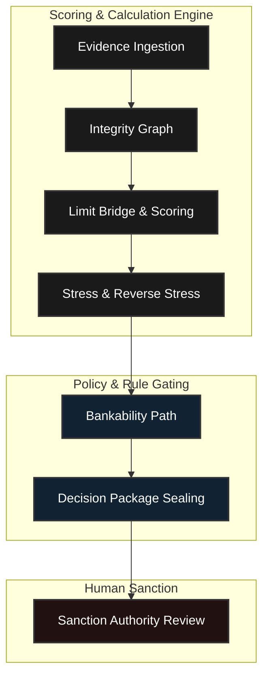

# Vyapar Pulse

A governed evidence-to-sanction operating system for MSME credit.

## Deployment Links
- **Frontend (Vercel)**: [https://frontend-swart-ten-40haipc0xl.vercel.app](https://frontend-swart-ten-40haipc0xl.vercel.app)
- **Backend (Vercel)**: [https://vyapar-pulse-backend.vercel.app](https://vyapar-pulse-backend.vercel.app)
- **API Documentation (Swagger)**: [https://vyapar-pulse-backend.vercel.app/docs](https://vyapar-pulse-backend.vercel.app/docs)
- **GitHub Repository**: [https://github.com/Sauravssoni/IDBI-INNOVATE-2026](https://github.com/Sauravssoni/IDBI-INNOVATE-2026)

## Strict Architectural Separation

Vyapar Pulse enforces a strict separation of concerns across its decision chain, ensuring that scoring and calculation are isolated from the human sanction process.

## The Five Invariant Gates

Every decision package generated by the system undergoes rigorous synthetic invariance testing to validate the core engine continuously against monotonic logic invariants:

1. **Revenue Monotonicity**: Higher revenue with identical margins must yield equal or greater supportable limits.
2. **Obligation Monotonicity**: Higher existing obligations must yield strictly equal or lower supportable limits.
3. **Debt-to-EBITDA Constraint**: Any scenario where the Debt-to-EBITDA ratio exceeds 4.0x must result in a binding constraint and zero limit.
4. **Cash Flow Constraint**: Any scenario with negative post-loan DSCR must result in a binding constraint and zero limit.
5. **Concentration Limit**: Any single product limit cannot exceed 60% of the total revenue.

## 25-Case Cryptographic Verification Loop

The system operates a deterministic 25-case cryptographic verification loop built into the release assurance pipeline. For each selected case, the system:
1. Builds a canonical assessment.
2. Constructs the `DecisionPackage`.
3. Seals the package using tamper-evident hashing (SHA-256).
4. Verifies the package hash.
5. Runs an independent full-engine replay.
6. Compares the governed outputs against the sealed package to detect any mismatches.

This loop demonstrates deterministic reproduction for the tested synthetic cases and the payload disclosure is an exact match to the engine's real-time state.

- 1,000 deterministic synthetic cases
- zero executed invariant failures
- 25 production-serializer engine replay checks
- no real-world predictive-performance claim

[Deterministic Validation and Replay Proof (1,000 Cases)](artifacts/validation/release_assurance.json)

## Explicit Limitations
- The integrity graph relationships used for demonstration are seeded.
- The validation cohort uses bounded synthetic profiles designed specifically for invariant testing.
