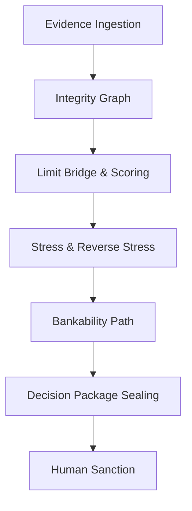

# Vyapar Pulse

A governed evidence-to-sanction operating system for MSME credit.

[Live Demo] | [API Docs] | [Three-minute Judge Route]

Current candidate SHA: 97731ad (Commit 2)
Current tag: v1.3.5-idbi-submission-candidate

  

<br/>


## Why a scorecard is insufficient

Traditional scorecards mask risk behind abstract numbers. Vyapar Pulse operates differently. We enforce a governed decision chain where every assessment, capacity calculation, and stress test is directly traced back to verified multi-rail evidence.

## The governed decision chain



## Three-minute judge journey

Our premium Decision Room consolidates the entire evaluation into an 8-section command centre:
1. Evidence and Integrity
2. Financial Health Waterfall
3. Product Comparison
4. Limit Bridge
5. Stress and Reverse Stress
6. Bankability and Analyst Recommendation
7. Human Sanction
8. Package Verification and Replay

## Four personas

The system includes deterministic seeded cases for demonstration:
- **Shakti**: Assessable / approvable.
- **Navprerna**: Insufficient evidence.
- **Rangrez**: Contradiction / integrity review.
- **Nirmaan**: Negative cash / decline.

## Evidence Passport

Vyapar Pulse categorizes evidence into tiers (e.g., Tier 1: Core Financials) to ensure transparency and reliability.

## Financial Health and Waterfall

A transparent view of Vyapar Credit Health Score and Financial Health Index (FHI) alongside the six foundational pillars.

| Metric | Type | Source |
|--------|------|--------|
| Credit Score | Scaled (300-900) | Multi-rail features |
| FHI | Decimal | Core Ratios |

## Four products and Limit Bridge

Comparison across: Working Capital Line, Term Loan, Receivables Finance, Equipment Finance.
Formula: `Final Limit = min(Requested, Product Capacity, DSCR Limit)`

## Stress and Reverse Stress

Authoritative downside resilience checks, including reverse stress boundaries that compute exact breaking points (e.g., when DSCR falls below 1.0x).

## Bankability Path

Actionable structural interventions generated dynamically when current financials do not support the requested limit.

## Human maker-checker sanction

The final approval layer requires manual intervention to review the request, mandate ceilings, and record formal rationale.

## Decision Package and replay

Every evaluation produces a cryptographically sealed `DecisionPackage` (SHA-256) ensuring non-repudiation and replayability for audit trails.

## Validation and assurance

Rigorous synthetic invariance testing validates the core engine continuously:
- **1,000 deterministic synthetic invariant executions.**
- Validates credit boundaries, limit caps, and logic paths.

## Security

Secure endpoints, strict `mypy` typing, format checks, and stateless deployments.

## Prototype interoperability

Seamless frontend integration utilizing React Next.js and Tailwind.

## Local reproduction

```bash
# Clone the repository
git clone <url>

# Run backend
cd backend
python -m uvicorn app.main:app --reload

# Run frontend
cd frontend
npm run dev
```

## Explicit limitations

- Non-cryptographic integrity graphs (seeded demonstrations).
- Validation cohort uses synthetic bounded profiles.
