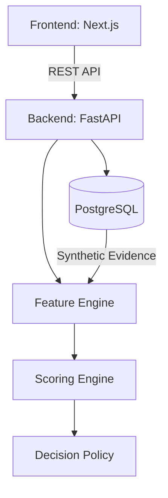

# VYAPAR PULSE AI

An Evidence-First Financial Health Card, MSME Credit Twin, and Safe-Offer Engine for credit-invisible Indian MSMEs. Built for the **IDBI Innovate 2026 Track 03** submission by **Syntheon Technology Private Limited**.

## Mission
Vyapar Pulse AI helps banking institutions assess New-to-Bank (NTB) MSMEs lacking traditional financial documents. It achieves this by combining synthetic GST data, consented Account Aggregator-style banking data, UPI aggregates, EPFO employment trends, and invoice metrics into a deterministic, fully explainable "Credit Twin". 

This is **not** a generic dashboard and **not** an LLM wrapper. LLMs are strictly bounded to generating narrative summaries; the authoritative scoring logic is 100% deterministic, monotonic, and bounded code.

## Key Capabilities & Safety Invariants
- **Deterministic Bounded Scoring:** Scores (Health, Evidence, Resilience) are mathematically guaranteed to remain between `[0, 100]`.
- **Monotonic Stress Response:** As risk factors (e.g., buyer concentration, payment delays) increase, resilience scores strictly decrease or remain stable.
- **Evidence-Linking:** Every feature is derived directly from auditable underlying data (GST, Bank, EPFO).
- **Strict Architecture Boundaries:** LLMs cannot modify authoritative scores. Data flows via a strict Clean Architecture pattern.

## Architecture



## Documentation
Please refer to the `docs/` directory for mandatory banking and security documentation:
- `docs/security/SECURITY_ARCHITECTURE.md`
- `docs/security/THREAT_MODEL.md`
- `docs/security/PRIVACY_AND_CONSENT.md`
- `docs/security/INCIDENT_RESPONSE.md`
- `docs/security/SECURITY_TEST_REPORT.md`
- `docs/models/MODEL_CARD.md`
- `docs/models/DATA_CARD.md`
- `docs/models/SCORING_METHODOLOGY.md`
- `docs/privacy/RESPONSIBLE_AI.md`

## Getting Started

### Prerequisites
- Docker & Docker Compose
- Python 3.10+
- Node.js 18+

### Setup Instructions

1. **Start the Database**
```bash
docker-compose up -d db
```

2. **Initialize Backend & Run Migrations**
```bash
cd backend
python3 -m venv .venv
source .venv/bin/activate
pip install -r requirements.txt
alembic upgrade head
```

3. **Generate Synthetic Data (Shakti Precision Components)**
```bash
make seed
```
*(This generates 18 months of deterministic evidence: GST, Bank, Invoices, EPFO).*

4. **Run the Backend API**
```bash
cd backend
source .venv/bin/activate
uvicorn app.main:app --host 0.0.0.0 --port 8001
```

5. **Test the Evaluation Engine**
```bash
# Get the case ID
curl -s http://localhost:8001/api/cases/
# Example evaluation:
# curl -s -X POST http://localhost:8001/api/cases/<case_id>/evaluate
```

## Distinguishing Business Archetypes
The Decision Policy automatically categorizes MSMEs into four distinct profiles based on evidence:
1. **Financially Weak:** Low financial health score (e.g., declining revenue, poor bank reconciliation).
2. **Healthy but Credit Invisible:** High financial health, but low evidence score (insufficient months of data).
3. **Viable but Seasonal:** Good health but high revenue coefficient of variation (CV).
4. **Suspicious:** E.g., High declared GST revenue but extremely low corresponding bank credits.

## Repository Quality Standards
This repository enforces:
- Clean Architecture (API, Core, Domain, DB layers isolated)
- SQLAlchemy ORM with Alembic schema migrations
- Deterministic data seeding for reproducibility
- Security by design (threat models and access controls documented)
