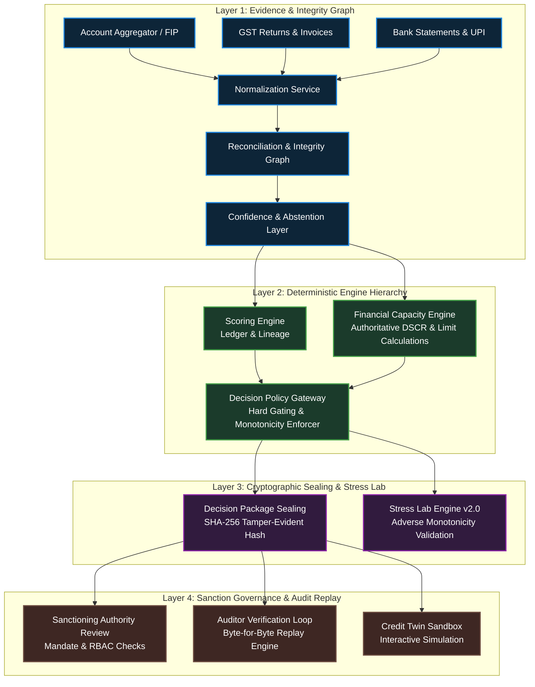

# Vyapar Pulse System Architecture Specification

**Version:** `2.0-STRESS-CANONICAL`  
**Classification:** `INSTITUTIONAL GOVERNED CREDIT OPERATING SYSTEM`  
**Reference Protocol:** `OCEN 4.0 / Account Aggregator Interoperability`

---

## 1. Executive Summary & Core Design Philosophy

Vyapar Pulse enforces a **strict computational separation of concerns** across the entire MSME credit underwriting lifecycle. Traditional banking interfaces often blend data ingestion, risk scoring, financial limit estimation, and human sanctioning into single monolithic applications or spreadsheets where operators can manually override formulas or distort underlying assumptions.

In contrast, Vyapar Pulse decouples the system into four immutable layers:
1. **Evidence Ingestion & Integrity Graph:** Ingests raw Account Aggregator (AA) data, GST returns, bank statements, and bureau records into an append-only graph that reconciles discrepancies before scoring.
2. **Deterministic Mathematical Hierarchy:** Executes exact, version-controlled scoring (`ScoringEngine`) and financial capacity models (`FinancialCapacityEngine`) that compute DSCR, working capital gaps, and binding limits.
3. **Cryptographic Sealing & Policy Gating:** Evaluates hard policy boundaries and freezes every proposal into a tamper-evident, `SHA-256` hashed `DecisionPackage`.
4. **Governed Human Sanction & Replay:** Allows organizational authorities (`Sanctioning Authority`, `Credit Analyst`, `Relationship Manager`) to act within strict, role-gated mandates without ever modifying underlying mathematical outputs.



---

## 2. Layer-by-Layer Micro-Service Architecture

### 2.1 Consent & Purpose Governance Service
* **Responsibility:** Manages customer consent grants, purpose codes, expiry timestamps, and revocation events.
* **Invariant:** No downstream engine or service reads customer financial data without an active, verified purpose grant (`CONSENT_ACTIVE`). All access history is logged to the append-only `case_events` table.

### 2.2 Source Adapters & Normalization (`app/adapters/`)
* **Account Aggregator (AA) Adapter:** Consumes encrypted FIP payloads, validates digital signatures, and normalizes bank transaction streams into structured inflow/outflow ledgers.
* **GST & Tax Adapter:** Ingests monthly GST returns (`GSTR-1`, `GSTR-3B`), validates turnover figures, and verifies tax compliance status.
* **Bureau & Debt Adapter:** Extracts verified existing debt service obligations (`verified_existing_debt_service_monthly`) and debt-to-EBITDA ratios.

### 2.3 Reconciliation & Integrity Graph
* **Responsibility:** Cross-verifies entity identities (matching PAN, GSTIN, and Bank Account names) and tests whether reported figures agree within explainable tolerances.
* **Abstention Trigger:** If a material discrepancy exists between reported GST turnover and verified bank inflows without a valid explanation, the **Confidence & Abstention Layer** sets `obligation_verification_state = UNVERIFIED` or `INSUFFICIENT_TO_ASSESS`, immediately halting automated limit approvals.

### 2.4 Authoritative Financial Capacity Engine (`app/domain/financial/engine.py`)
* **Responsibility:** The single source of truth for all quantitative underwriting calculations.
* **Core Equations:**
  $$\text{Current DSCR} = \frac{\text{Monthly Operating Inflows} - \text{Baseline Outflows}}{\text{Verified Existing Debt Service Monthly}}$$
  
  $$\text{Post-Loan DSCR} = \frac{\text{Operating Inflows} - \text{Outflows}}{\text{Existing Debt Service} + \text{Proposed Monthly Installment}}$$
* **Defensive Type Safety:** Implements strict conversion wrappers (`_safe_decimal`, `_safe_int`) to guarantee zero runtime crashes (`decimal.InvalidOperation`) regardless of malformed string or float inputs from legacy data sources.

### 2.5 Decision Policy Gateway (`app/core/decision/policy.py`)
* **Responsibility:** Evaluates quantitative health indices against institutional underwriting boundaries.
* **Hard Gating Rules (Zero-Override):**
  1. **Debt-to-EBITDA Gate:** If `debt_to_ebitda > 4.0x`, the binding limit is clamped to `₹0.00` (`DECLINE_RECOMMENDED`).
  2. **DSCR Viability Gate:** If `post_loan_dscr < 1.00x`, the binding limit is clamped to `₹0.00` (`DECLINE_RECOMMENDED`).
  3. **Concentration Gate:** Any single product limit is strictly bounded below $60\%$ of verified annual revenue.

---

## 3. Mathematical Monotonicity Theorems & Invariant Enforcement

To eliminate algorithmic hallucinations and ensure strict logical consistency across all evaluation tiers, the system enforces three mathematical monotonicity theorems:

### Theorem 1: Revenue Monotonicity
Given an existing debt obligation $O$ and operating expense profile $E$, any increase in verified monthly operating inflow $I_2 \ge I_1$ must produce an equal or higher binding product limit $L$:
$$\forall I_2 \ge I_1 \implies L(I_2, O, E) \ge L(I_1, O, E)$$

### Theorem 2: Obligation Monotonicity
Given an operating inflow $I$ and expense profile $E$, any increase in verified existing monthly debt service $O_2 \ge O_1$ must produce a strictly equal or lower binding product limit $L$:
$$\forall O_2 \ge O_1 \implies L(I, O_2, E) \le L(I, O_1, E)$$

### Theorem 3: Adverse Stress Monotonicity Invariant (`app/domain/stress/engine.py`)
Under any adverse stress simulation characterized by a revenue drop percentage $r_{\text{drop}} > 0$ or interest rate hike $\Delta i_{\text{hike}} > 0$, the recomputed supportable credit limit $L_{\text{adverse}}$ must never exceed the baseline supportable limit $L_{\text{baseline}}$:
$$\forall (r_{\text{drop}} > 0 \lor \Delta i_{\text{hike}} > 0) \implies L_{\text{adverse}} \le L_{\text{baseline}}$$
* **Enforcement:** The engine embeds explicit runtime assertions (`assert custom_limit <= base_limit, "adverse_supportable_amount <= baseline_supportable_amount"`) during both canned scenario evaluations and interactive `CreditTwin` stress queries.

---

## 4. Cryptographic Decision Package Sealing (`/verify` & `/replay`)

Every credit proposal transitioned to `READY_FOR_REVIEW` or `CONDITIONAL_OFFER` undergoes canonical package sealing via `POST /api/cases/{caseId}/decision-package`.

### 4.1 Canonical SHA-256 Hash Generation
The engine serializes all inputs into a deterministic JSON string (`package_payload`):
```json
{
  "case_id": "UUID",
  "assessment_snapshot": { ... },
  "financial_metrics": { "current_dscr": 2.14, "post_loan_dscr": 1.45, ... },
  "score_contribution_ledger": [ ... ],
  "binding_limit": 3569042.50,
  "policy_rule_id": "PR_TERM_LOAN_PRIME_001",
  "timestamp": "2026-07-13T14:00:00Z"
}
```
A cryptographic digest (`package_hash = SHA-256(canonical_json)`) is generated and returned alongside `package_id`.

### 4.2 Route Hygiene & Independent Replay Engine
* **Isolation Contract:** Verification routes are explicitly defined as `/api/cases/{caseId}/decision-package/{package_id}/verify` and `/replay`. The parameter `case_id` is never injected or overloaded into `package_id`.
* **Replay Execution (`POST /replay`):** When invoked, the server retrieves the sealed historical payload by `package_id`, re-runs `ScoringEngine` and `FinancialCapacityEngine` from scratch using that exact historical feature snapshot, and verifies that the newly recomputed outputs match the historical payload exactly byte-for-byte (`INDEPENDENT REPLAY MATCHED`).

---

## 5. Role-Based Access Control (RBAC) & Governance Matrix

The governance plane strictly prevents both **Vertical Privilege Escalation** and **Horizontal Mandate Violation**:

```mermaid
matrix
    title Institutional RBAC Permission Matrix
    row RM "Relationship Manager"
    row Analyst "Credit Analyst"
    row SA "Sanctioning Authority"
    row Auditor "Auditor / Regulator"
    row Admin "System / Risk Admin"
    col Create "Create Case / Ingest Evidence"
    col Assess "Run Assessment / Simulate"
    col Sanction "Issue Loan Sanction"
    col Audit "Verify & Replay Seals"
    col Policy "Configure Global Policy"
```

* **Vertical Escalation Blocked:** System Administrators (`RISK_ADMIN`) can manage global underwriting policy thresholds but are programmatically blocked from evaluating or sanctioning individual credit cases (`test_security.py`).
* **Horizontal Mandate Blocked:** Credit Analysts (`CREDIT_ANALYST`) can run recommendations and simulate scenarios (`SimulatorTab`) but cannot approve loans. Sanctioning Authorities (`SANCTIONING_AUTHORITY`) can approve proposals within their financial authorization tier, but any approval attempt above their limit triggers an immediate `403 Forbidden` (`OUTSIDE_SANCTION_MANDATE`).

---

## 6. Production Safety Controls & Runtime Assurance

1. **Advisory Locking for Demo Resets (`pg_try_advisory_lock`):** To eliminate race conditions or test pollution during automated verification, database resets acquire exclusive PostgreSQL advisory locks (`ID: 9991234`). If two tests or operators attempt simultaneous resets, the secondary request gracefully exits or waits without corrupting transactional integrity.
2. **Strict Production URL Hygiene:** When `APP_ENV=production`, the application runtime forbids unencrypted `http://` endpoints or `localhost` database configurations (`test_runtime.py`, `test_browser_config.py`).
3. **Continuous Audit Hash Chain:** Every state transition in `case_events` includes the hash of the preceding event (`previous_hash`), forming an unbroken, tamper-evident cryptographic chain from initial application submission to final sanction signing.

---

<div align="center">
  <p><b>Vyapar Pulse Architecture — Built for Institutional Auditability, Deterministic Precision, and Absolute Governance.</b></p>
</div>
